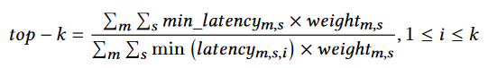
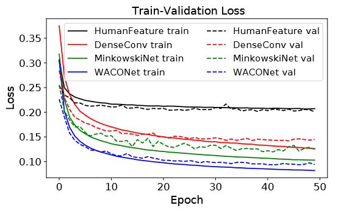
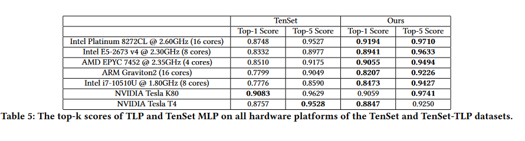
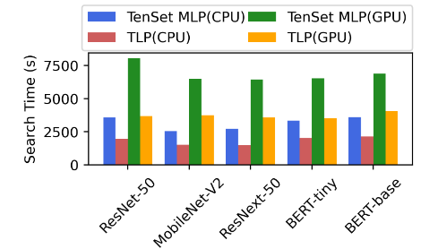
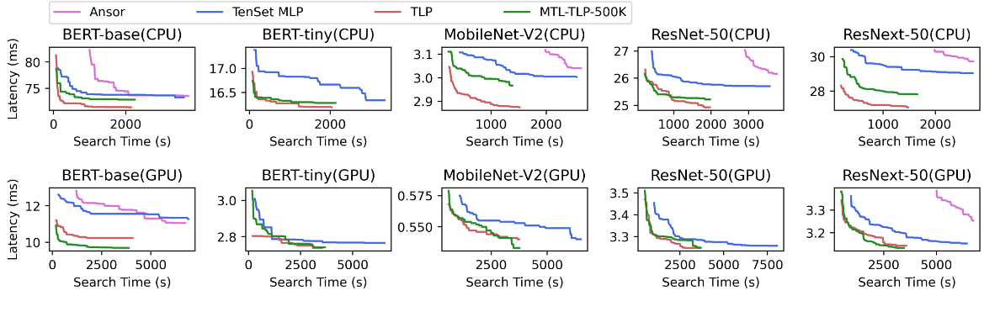
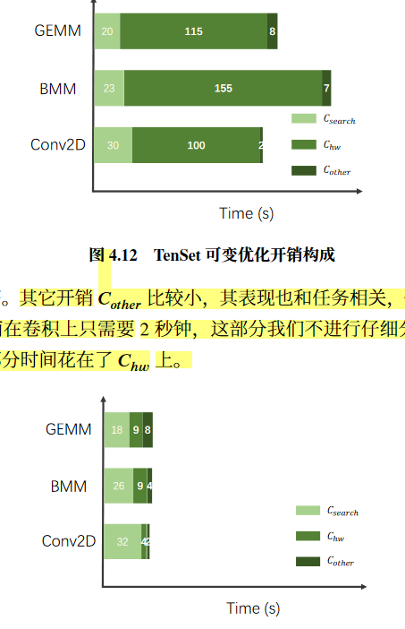
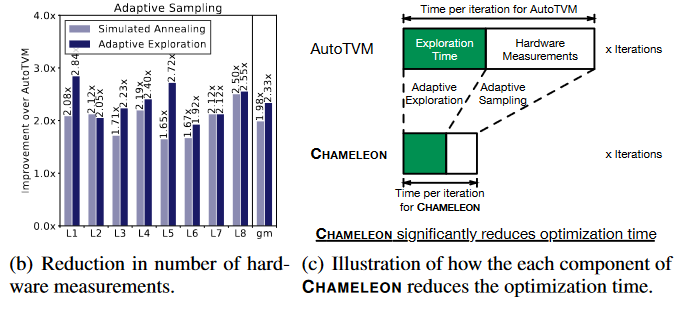
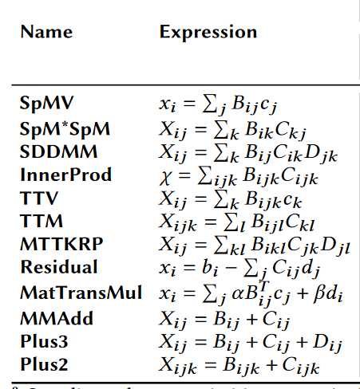

# AutoSparse Net

### 稀疏张量特征提取网络模块
waco 的代码中，使用的多层Conv，实际代码里面只有stride 步长，即只是用了跨步卷积
那么是否可以尝试空洞卷积呢？
> 参考
> https://www.zhihu.com/search?type=content&q=%E7%A9%BA%E6%B4%9E%E5%8D%B7%E7%A7%AF
> https://zhuanlan.zhihu.com/p/50369448

空洞卷积可以有更大的感受野。
但其中连续dilated参数相同时候最后面层的感受野会漏掉附近的一些元素，因此一般不同的空洞参数互相组合为一个 Hybrid Dilated Convolution (HDC) block。

此外，waco文中说明由于其GPU显存问题，无法使用更大的Channel数来容纳特征，只能使用32，所以将多层的卷积Pooling结果拼接作为结果。那我们是否是可以在GPU足够大情况下可以不这样做多层拼接，直接使用最终层的池化结果。

那么就是多个 HDC block 连接形成我们的网络。


### Tokenizer
注意各个映射出来的数字太大要做 Normalize，缩减为小的浮点数

```
2 i 2 i0 256 i1 16 k 2 k0 4096 k1 16 1 A 4 i0 i1 k0 k1 A 4 i0 1 i1 1 k0 1 k1 1 1 j 2 j0 2 j1 64 6 j0 i0 i1 k0 k1 j1 j0 j1 None 0 128 512 445.855559
这个的组成来自 schedule.Schedule.GenConfigCommand的返回值[1] + latency lable
```
除了schedule编码，还需要编码矩阵的信息，参考论文 SpTFS, 包括 规则化后的 shape、nnz、sparsity

1. 符号表映射

2. 原语 one-hot 编码
fsplit freorder fmode lsplit lreorder parallel vectorize unroll sparse_matirx_info sparse_matirx_embedding
3. 特征向量编码组装

### 网络结构
- 使用Transformer decoder模块，NLP语言方便输入各种算子的调度编码
- 网络层数：使用一层还是两层attention 模块
- 稀疏张量特征编码
    - 可以放在第一层 attention模块和输入token一起输入，
    - 也可以放在第一层的结果进行拼凑
- 最终的结果使用SUM求和，然后用rank loss，
    - 可以是WACO 的方式，
    - 也可以是TLP的方式


### Loss function 与 训练方案
WACO 使用的是nn.MarginRankingLoss——排序损失 https://blog.csdn.net/qq_50001789/article/details/128974619
WACO是一个算子一个模型，训练时候一个输入稀疏矩阵的不同数据（大约200个）按照batch=32开始累计做互相的rank loss

TLP的是 randomRankingLoss，然后训练的数据是先对label做处理，将 latency/min_latency 获得同一shape和算子下的相对值，则label=1时候最好，则所有算子的所有shape、所有输入稀疏张量数据都可以放在一起混合训练

### 训练时问题
- 总是出现OOM，
    - 尝试batch_size 小一点，小到32还是有OOM，检查发现可能是sparse matrix太大，导致conv net 会很大，
    - 因此筛选哪些matrix不能用，一般来说 nnz越大，占显存就会越大
    - 那么对total_dataset.txt 中数据都跑一遍，注意schedule_batch 提前跳出即可，看什么数据有OOM


### 模型评估指标
1. loss值
loss值越趋近0越好

2. topk acc
见Tenset和TLP中的定义，即预测出的topk，拿到他们在原来 true runtimes列表中的runtime值，找其中最小的 pre_true_min ，将全true runtimes最小的 true_min 除以 pre_true_min，即  true_min / pre_true_min, 可知这个结果在[0,1]区间，找的越好，则值越接近1，就是acc准确率



### 结果呈现

1. loss 的训练下降图
    
    baseline选择：WACONet_spmm, AutoSparseNet_WACONet_spmm, AutosparseNet_spmm, AutoSparseNet_Full
    结果：AutosparseNet_spmm, AutoSparseNet_Full的下降效果最好，loss能达到最低，或者是更快收敛
2. TopK Acc
    baseline选择：WACONet_spmm, AutoSparseNet_WACONet_spmm, AutosparseNet_spmm, AutoSparseNet_Full
    结果1：AutosparseNet_spmm 比 前两个效果都好
    结果2：AutoSparseNet_Full能在数据和但算子持平情况达到和单算子一样的效果
    

3. 带costmodel的搜索找到的算子性能和普通搜索齐平

4. 加速搜索效率效果
    造3个图：
    - 图1 3中每一个的搜索时间对比，是否有costmodel，柱状图
    - 图2 是搜索的收敛图，在3中每一个，更快达到最佳性能结果
    - 图3 从3中调一组，搜索程序中各个部分时间分布图，测试性能部分降低多少倍，或者是说减少的硬件测试次数
    
    
    
    
    

0.188, AccTop1: 0.614, AccTop5: 0.986, Valid loss: 0.219
### 模型训练日志
##### 2025-01-04
| 模型结构 | 数据集选择 | TrainLoss | ValLoss | Top1Acc | Top5Acc | 备注 | 模型日志 |
| --- | --- | --- | --- | --- | --- | --- | --- |
| autosparse_1 | platinum8272cl_spmm | 0.167 | 0.226 | 0.572 | 0.989 | 75epoch | cost_model_train__0_1xeon_platinum8272cl_spmm_2025-01-04.txt |
| autosparse_1 | platinum8272cl_spmv | 0.259 | 0.284 | 0.284 | 0.890 | 75epoch | cost_model_train__0_1xeon_platinum8272cl_spmv_2025-01-04.txt |
| autosparse_1 | platinum8272cl_spmv_spmm_sddmm | 0.273 | 0.283 | 0.695 | 0.987 | 只跑到了52epoch | cost_model_train__0_1xeon_platinum8272cl_spmv_xeon_platinum8272cl_spmm_xeon_platinum8272cl_sddmm_2025-01-04.txt |
| autosparse_2 | platinum8272cl_spmm | 0.188 | 0.219 | 0.614 | 0.986 | 75epoch | cost_model_train__0_0xeon_platinum8272cl_spmm_2025-01-04.txt |
| WACONet_128 | platinum8272cl_spmm | 0.154 | 0.198 | 0.734 | 0.995 | 75epoch | cost_model_train__1_1xeon_platinum8272cl_spmm_2025-01-04.txt |
| WACONet_128 | platinum8272cl_spmv | 0.272 | 0.290 | 0.256 | 0.872 | 75epoch | cost_model_train__1_1xeon_platinum8272cl_spmv_2025-01-05.log |
| WACONet_128 | platinum8272cl_spmv_spmm_sddmm | 0.218 | 0.249 | 0.668 | 0.982 | 75epoch | cost_model_train__1_1xeon_platinum8272cl_spmv_xeon_platinum8272cl_spmm_xeon_platinum8272cl_sddmm_2025-01-04.txt |

##### 2025-01-11
使用lanbdarankingloss来训练

| 模型结构 | 数据集选择 | TrainLoss | ValLoss | Top1Acc | Top5Acc | 备注 | 模型日志 |
| --- | --- | --- | --- | --- | --- | --- | --- |
| autosparse_1 | platinum8272cl_spmm | 0.841 | 0.993 | 0.808 | 0.993 | 75epoch lanbdarankingloss | cost_model_train__0_1xeon_platinum8272cl_spmm_2025-01-11.log |
| autosparse_1 | platinum8272cl_spmv | 3.260 | 4.676 | 0.704 | 0.922 | 75epoch lanbdarankingloss | cost_model_train__0_1xeon_platinum8272cl_spmv_2025-01-11.log |
| autosparse_1 | platinum8272cl_spmv_spmm_sddmm | 1.384 | 1.444 | 0.812 | 0.979 | 只跑到了31epoch lanbdarankingloss | cost_model_train__0_1xeon_platinum8272cl_spmv_xeon_platinum8272cl_spmm_xeon_platinum8272cl_sddmm_2025-01-11.log |
| autosparse_2 | platinum8272cl_spmm | 0.930 | 1.301 | 0.809 | 0.991 | 75epoch lanbdarankingloss | cost_model_train__0_0xeon_platinum8272cl_spmm_2025-01-11.log |
| WACONet_128 | platinum8272cl_spmm | 0.691 | 1.389 | 0.826 | 0.992 | 75epoch lanbdarankingloss | cost_model_train__1_1xeon_platinum8272cl_spmm_2025-01-11.log |
| WACONet_128 | platinum8272cl_spmv_spmm_sddmm | 0.860 | 1.224 | 0.829 | 0.978 | 75epoch lanbdarankingloss | cost_model_train__1_1xeon_platinum8272cl_spmv_xeon_platinum8272cl_spmm_xeon_platinum8272cl_sddmm_2025-01-04.txt |

##### 2025-01-13 / 14
使用data_handle_max处理数据，用marginrankingloss来训练

| 模型结构 | 数据集选择 | TrainLoss | ValLoss | Top1Acc | Top5Acc | 备注 | 模型日志 |
| --- | --- | --- | --- | --- | --- | --- | --- |
| autosparse_1 | platinum8272cl_spmm | 0.178 | 0.221 | 0.822 | 0.990 | 75epoch marginrankingloss | cost_model_train__0_1xeon_platinum8272cl_spmm_2025-01-13.log |
| autosparse_1 | platinum8272cl_spmv | 0.256 | 0.286 | 0.675 | 0.928 | 75epoch marginrankingloss | cost_model_train__0_1xeon_platinum8272cl_spmv_2025-01-13.log |
| WACONet_128 | platinum8272cl_spmm | 0.132 | 0.198 | 0.857 | 0.996 | 75epoch marginrankingloss | cost_model_train__1_1xeon_platinum8272cl_spmm_2025-01-14.log |


##### 2025-01-15
更换网络结构CNN部门，空洞卷积和跨步卷积结合,先两层空段卷积block，再加6层跨步卷积
结果： 对于 
cost_model_train__0_1xeon_platinum8272cl_spmm_2025-01-15.log
cost_model_train__0_1xeon_platinum8272cl_spmv_2025-01-15.log
cost_model_train__0_0xeon_platinum8272cl_spmm_2025-01-15.log
都跑了35 epoch，横向对比之前的网络结构，效果稍稍降低，尤其是对比不过WACONet_128，Top1Acc差距非常大


##### 2025-01-16
更换网络结构CNN部门，空洞卷积和跨步卷积结合，空段卷积和跨步卷积交叉用，第一次空洞卷积只用两层，后面的一个空洞卷积用三层的block
| 模型结构 | 数据集选择 | TrainLoss | ValLoss | Top1Acc | Top5Acc | 备注 | 模型日志 |
| --- | --- | --- | --- | --- | --- | --- | --- |
| autosparse_1 | platinum8272cl_spmm | 0.149 | 0.210 | 0.853 | 0.993 | 95epoch marginrankingloss | cost_model_train__0_1xeon_platinum8272cl_spmm_2025-01-16.log |
| autosparse_1 | platinum8272cl_spmv | 0.251 | 0.285 | 0.650 | 0.920 | 95epoch marginrankingloss | cost_model_train__0_1xeon_platinum8272cl_spmv_2025-01-16.log |
| autosparse_2 | platinum8272cl_spmm | 0.158 | 0.212 | 0.822 | 0.992 | 71epoch marginrankingloss | cost_model_train__0_1xeon_platinum8272cl_spmm_2025-01-16.log |

##### 2025-01-17
更换网络结构CNN部门，空洞卷积和跨步卷积结合，空段卷积和跨步卷积交叉用，第一次空洞卷积只用两层，后面的一个空洞卷积用三层的block
再将空洞卷积每一层引导出来做pooling合并


| 模型结构 | 数据集选择 | TrainLoss | ValLoss | Top1Acc | Top5Acc | 备注 | 模型日志 |
| --- | --- | --- | --- | --- | --- | --- | --- |
| autosparse_1 | platinum8272cl_spmm | 0.170 | 0.209 | 0.854 | 0.996 | 最大的62epoch marginrankingloss | cost_model_train__0_1xeon_platinum8272cl_spmm_2025-01-17.log |
| autosparse_1 | platinum8272cl_spmv | 0.277 | 0.283 | 0.700 | 0.916 | 48epoch收敛 marginrankingloss | cost_model_train__0_1xeon_platinum8272cl_spmv_2025-01-17.log |


尝试将 sparse matrix也加上one-hot 编码
| 模型结构 | 数据集选择 | TrainLoss | ValLoss | Top1Acc | Top5Acc | 备注 | 模型日志 |
| --- | --- | --- | --- | --- | --- | --- | --- |
| ~~autosparse_2~~ | ~~platinum8272cl_spmm~~ | ~~0.190~~ | ~~0.238~~ | ~~0.821~~ | ~~0.990~~ | 最大的71epoch marginrankingloss 注意这个网络结构有问题，错误的结果应该是 | cost_model_train__0_0xeon_platinum8272cl_spmm_2025-01-17.log |
| WACONet_128 | platinum8272cl_spmm | 0.133 | 0.196 | 0.862 | 0.993 | 最大的91epoch marginrankingloss | cost_model_train__1_1xeon_platinum8272cl_spmm_2025-01-17.log |

##### 2025-01-22
在原有基础上，可能是WACO——net是128的channel，而我们使用的是32的channel,现在更改为普通跨步卷积的使用128，dilation的32channel

| 模型结构 | 数据集选择 | TrainLoss | ValLoss | Top1Acc | Top5Acc | 备注 | 模型日志 |
| --- | --- | --- | --- | --- | --- | --- | --- |
| autosparse_1 | platinum8272cl_spmm | 0.127 | 0.207 | 0.863 | 0.992 | 128channel 最大的97epoch marginrankingloss | cost_model_train__0_1xeon_platinum8272cl_spmm_2025-01-22.log |
| autosparse_1 | platinum8272cl_spmv | 0.259 | 0.283 | 0.674 | 0.923 | 128channel 最大的89epoch marginrankingloss | cost_model_train__0_1xeon_platinum8272cl_spmv_2025-01-22.log |
| autosparse_2 | platinum8272cl_spmm | 0.142 | 0.224 | 0.821 | 0.989 | 128channel 最大的95epoch marginrankingloss | cost_model_train__0_0xeon_platinum8272cl_spmm_2025-01-22.log |

##### 2025-02-16
开始训练WACO_NET, 为了跨数据集的训练，改变其硬编码适合我们的数据集，还有适配三种算子

| 模型结构 | 数据集选择 | TrainLoss | ValLoss | Top1Acc | Top5Acc | 备注 | 模型日志 |
| --- | --- | --- | --- | --- | --- | --- | --- |
| waco_net | platinum8272cl_spmm | 0.149 | 0.194 | 0.833 | 0.991 | 32channel 最大的97epoch marginrankingloss | cost_model_train__False_Truexeon_platinum8272cl_spmm_2025-02-16.log |
| waco_net | platinum8272cl_spmv | 0.261 | 0.282 | 0.676 | 0.912 | 32channel 最大的89epoch marginrankingloss | cost_model_train__False_Truexeon_platinum8272cl_spmv_2025-02-16.log |
| waco_net | platinum8272cl_spmv_spmm_sddmm | 0. | 0. | 0. | 0. | 32channel 最大的95epoch marginrankingloss | cost_model_train__False_Truexeon_platinum8272cl_spmv_xeon_platinum8272cl_spmm_xeon_platinum8272cl_sddmm_2025-02-17.log |


### TODO
- ~~配置AutoSparse 测试各个部分的时间在 EPYC_7543 服务器~~ p0
- ~~尝试TrainNaive 上使用 randomloss func，看看结果效果~~ p0
- 实现TrainMix版本，p0
    - 同时考虑如何增加并行性，比如分矩阵类型减少矩阵conv的批大小，然后合并所有的小批进行batch atention计算， 最后分矩阵的批次进行backward
- ~~画出loss图~~，修改模型结构 p0
    - ~~尝试marginrankingloss使用max数据处理方案的效果： 效果稍稍更好了~~
    - ~~修改模型结构，空洞和跨步一起，forward1 forwad2一起~~
- **Autosparse 加算子的支持** p0 
    - ，并搞实验数据 p2

- TrainNaive 中增加训练并行度，第一步解决跨算子级合并一次计算与backward，第二步解决跨矩阵合并 p2
    - 可以划分阶段：
        - a.并行不同输入的矩阵稀疏模式编码CNN->得到batch的稀疏特征向量, （这里控制只bacth_size是矩阵数，而不是调度的batch数）
        - b.并行做不同稀疏特征向量和不同算子下调度数据的NLP推理, 但是结果要划分开，因为rank结果要在相同的矩阵和算子下比较
        - c.以稀疏张量数据为单位分别作backward （Note：为了解决不同稀疏张量数据的backward 梯度波动，可以处理数据集为相对的label）

- **WACONet的baseline训练** p0  
    - 按照WACO的方案设计一个新的AutoSparse spmm 算子模版
    - 训练spmm单算子基于已有的AutoSparse数据
    - 按照WACO的方案设计一个新的AutoSparse spmv 算子模版
    - 训练spmv单算子基于已有的AutoSparse数据
    - 按照WACO的方案设计一个新的AutoSparse sddmm 算子模版
    - 训练sddmm单算子基于已有的AutoSparse数据 
- **集成进入AutoSparse的搜索中** p0 

- **调整AutoSparse重新使用搜索的方法采集数据集** p1
- 在ARM上采集数据集 p1